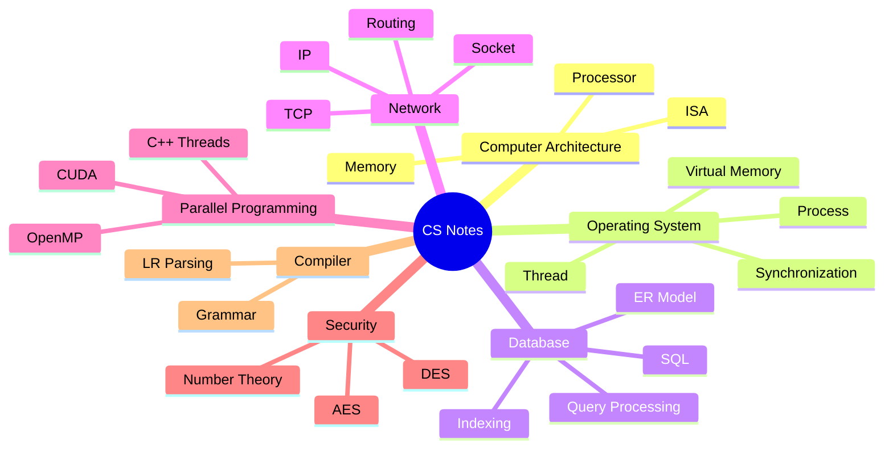

<div align="center">

# 📚 Computer Science Notes

컴퓨터공학 전공 과목을 공부하며 정리한 **Obsidian 기반 CS 학습 노트**입니다.  
운영체제, 데이터베이스, 컴퓨터구조론, 네트워크처럼 핵심 과목별 개념을 Markdown으로 정리합니다.


</div>

## 🧭 Overview

이 저장소는 강의와 개인 학습 내용을 과목별로 정리한 노트 모음입니다.  
각 과목 폴더의 `README.md`가 상세 목차 역할을 하며, 개별 노트에서는 개념 설명, 예시, 수식, 이미지 자료를 함께 다룹니다.



## 🗂️ Subjects

| 과목 | 주요 내용 |
|---|---|
| 🧱 [컴퓨터구조론](<컴퓨터구조론/README.md>) | 컴퓨터 추상화, 명령어 집합, 산술 연산, 프로세서, 메모리 |
| 🖥️ [오퍼레이팅시스템](<오퍼레이팅시스템/README.md>) | 프로세스, 스레드, CPU 스케줄링, 동기화, 교착상태, 메모리 관리 |
| 🗃️ [데이터베이스](<데이터베이스/README.md>) | 관계형 모델, SQL, ER 모델, 정규화, 저장 구조, 인덱싱, 쿼리 처리 |
| ⚙️ [병렬프로그래밍](<병렬프로그래밍/README.md>) | C++11 멀티스레딩, OpenMP, CUDA, 병렬 계산 패턴 |
| 🌐 [컴퓨터 네트워크](<컴퓨터 네트워크/README.md>) | OSI/TCP-IP 계층, IP, ARP, ICMP, 라우팅, TCP, TCP Socket |
| 🔐 [컴퓨터보안](<컴퓨터보안/README.md>) | 정수론, DES, AES, 블록 암호 운영 모드, 난수 생성 |
| 🧩 [컴파일러](<컴파일러/README.md>) | 문법, Bottom-up Parsing, LR(0), SLR |

## 🚀 How to Read

- GitHub에서는 위 표의 과목별 README에서 목차를 따라가면 됩니다.
- Obsidian에서는 Vault로 열어 내부 링크, 이미지, 그래프 뷰를 함께 볼 수 있습니다.
- 이미지 자료는 [images](<images/>) 폴더에 저장되어 있습니다.
- 일부 노트는 강의 흐름을 따라 작성되어 있어 과목별 번호 순서대로 읽는 것이 가장 자연스럽습니다.

## 🗃️ Repository Layout

```text
.
├── README.md
├── images/
├── Templates/
├── 데이터베이스/
├── 병렬프로그래밍/
├── 오퍼레이팅시스템/
├── 컴파일러/
├── 컴퓨터 네트워크/
├── 컴퓨터구조론/
└── 컴퓨터보안/
```

## ✏️ Note

개인 학습을 위해 정리한 자료라 일부 표현은 강의 맥락이나 작성 당시의 이해 흐름을 따릅니다. 내용은 계속 보완 중입니다.
